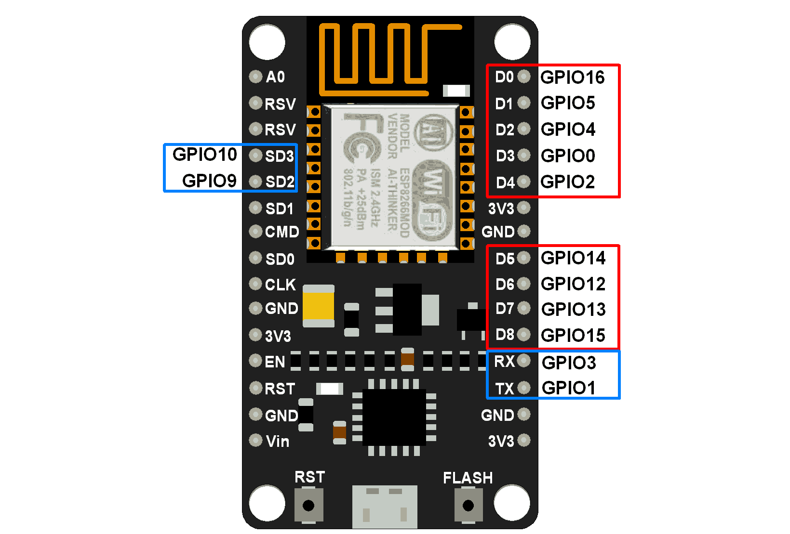
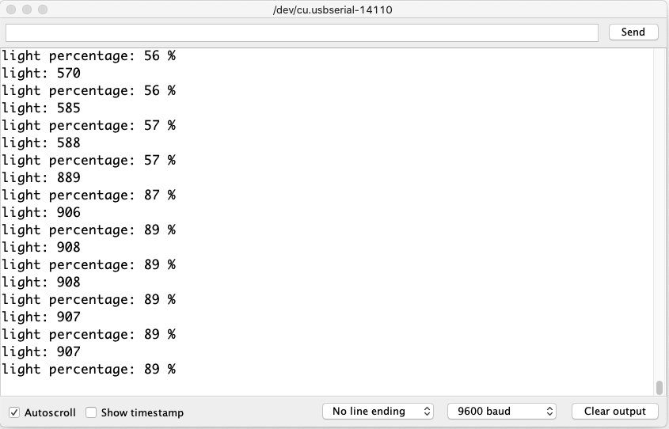

# Embedded Programming - Lab 1

Laboratory for Embedded Programming classes - Part 1 -  Based on the NodeMCU ESP8266

## About this Lab

The goal of this lab is to get started with embedded programming. We will be using the NodeMCU ESP8266 with the Arduino IDE:
- [Buy a NodeMCU ESP8266](https://www.aliexpress.com/item/32665100123.html)
- [Download the lastest Arduino IDE](https://www.arduino.cc/en/main/software)

## Steps

It should take about 2h30 min to complete all the steps

- Install Developer Environment (~20 min)
- Blink (10 min)
- General-purpose input/output (GPIO) (~15 min)
- Pulse Width Modulation (PWM) (~15 min)
- Analog to Digital Converter (ADC) (~25 min)
- Interrupts (~25 min)
- HTTP Server (~40 min)

## Install Developer Environment

NodeMCU is Lua based firmware of ESP8266. Generally, ESPlorer IDE is used to write Lua scripts for the NodeMCU board. It requires to get familiar with ESPlorer IDE and Lua scripting language. However, there is another way of developing NodeMCU programs with a well-known IDE: **Arduino IDE**. 

This makes things easy for Arduino developers than learning new language and IDE for NodeMCU.

Let’s see about setting up Arduino IDE with NodeMCU.

### Arduino IDE 
Download the lastest Arduino version: [https://www.arduino.cc/en/main/software](https://www.arduino.cc/en/main/software)


Open Arduino IDE and go to preferences:


Add the following link in the Additional Boards Manager URLs: `http://arduino.esp8266.com/stable/package_esp8266com_index.json`


Close Preference window and go to Tools -> Board -> Boards Manager...


In the Boards Manager window, type `esp` in the search box, esp8266 will be listed there below. 
Select latest version of board and click on install.


After installation of the board is complete, open Tools->Board->and select NodeMCU 1.0 (ESP-12E Module).


**Now Your Arduino IDE is ready for NodeMCU!!**

Let's test with the blink example, if it is not working, you may need to install the CH340G driver.


### CH340G driver

**MacOS:**
 
*Warning: Do not install if you have the current macOS Mojave 10.14 or later. macOS Mojave 10.14 (released in October 2018) includes a CH34x driver by Apple. If both Apple's and the OEM driver are installed, they will create conflicting non-functional serial ports.*

Otherwise, go to: [https://github.com/adrianmihalko/ch340g-ch34g-ch34x-mac-os-x-driver](https://github.com/adrianmihalko/ch340g-ch34g-ch34x-mac-os-x-driver)

**Windows:**

* Download the [Windows CH340 Driver](https://sparks.gogo.co.nz/assets/_site_/downloads/CH34x_Install_Windows_v3_4.zip)
* Unzip the file
* Run the installer which you unzipped
* In the Arduino IDE when the CH340 is connected you will see a COM Port in the Tools > Serial Port menu, the COM number for your device may vary depending on your system.

**Linux**

Drivers are almost certainly built into your Linux kernel already and it will probably just work as soon as you plug it in.  If not you can download the [Linux CH340 Driver](https://sparks.gogo.co.nz/assets/_site_/downloads/CH340_LINUX.zip) (but I’d recommend just upgrading your Linux install so that you get the  “built in” one).

## Blink on the NodeMCU board

Under the Blink/ folder, open the Blink.ino file

```
Embedded-Programming-Lab-1
│   README.md
│   LICENSE   
│
└───Blink
    │   Blink.ino 
```

Then, plug the NodeMCU board to your laptop.

Select the PORT as followed:


Click on the upload button, if everything goes well, the LED_BUILTIN should switch on for one second and stop for two seconds


Now change the blinking frequency to 500ms (500ms on and 500ms off).
Deploy your code again.

## General-purpose input/output (GPIO)

General-purpose input/output (GPIO) is a pin on an IC (Integrated Circuit). It can be either input pin or output pin, whose behavior can be controlled at the run time.

NodeMCU Development kit provides access to these GPIOs of ESP8266. The only thing to take care is that NodeMCU Dev kit pins are numbered differently than internal GPIO notations of ESP8266 as shown in below figure and table. For example, the D0 pin on the NodeMCU Dev kit is mapped to the internal GPIO pin 16 of ESP8266.



Below table gives NodeMCU Dev Kit IO pins and ESP8266 internal GPIO pins mapping

| Pin Names on NodeMCU Development Kit| ESP8266 Internal GPIO Pin number|
| ------------- |:-------------:| 
|D0|GPIO16|
|D1|GPIO5|
|D2|GPIO4|
|D3|GPIO0|
|D4|GPIO2|
|D5|GPIO14|
|D6|GPIO12|
|D7|GPIO13|
|D8|GPIO15|
|D9/RX|GPIO3|
|D10/TX|GPIO1|
|D11/SD2|GPIO9|
|D12/SD3|GPIO10|

The GPIO’s shown in blue box (1, 3, 9, 10) are mostly not used for GPIO purpose on Dev Kit

ESP8266 is a system on a chip (SoC) design with components like the processor chip. The processor has around 16 GPIO lines, some of which are used internally to interface with other components of the SoC, like flash memory.

Since several lines are used internally within the ESP8266 SoC, we have about 11 GPIO pins remaining for GPIO purpose.

Now again 2 pins out of 11 are generally reserved for RX and TX in order to communicate with a host PC from which compiled object code is downloaded.

Hence finally, this leaves just 9 general purpose I/O pins i.e. D0 to D8.

As shown in above figure of NodeMCU Dev Kit. We can see RX, TX, SD2, SD3 pins are not mostly used as GPIOs since they are used for other internal process. But we can try with SD3 (D12) pin which mostly like to respond for GPIO/PWM/interrupt like functions.

Note that D0/GPIO16 pin can be only used as GPIO read/write, no special functions are supported on it.

### Exercice Blink a LED using GPIOs

Create a new Arduino Sketch and save name it GPIO.ino:

```
Embedded-Programming-Lab-1
│   README.md
│   LICENSE   
│
└───Blink
|    │   Blink.ino 
│    │
└───GPIO
     │   GPIO.ino

```

Copy the following code:

```
uint8_t LED_Pin = D4;       // declare LED pin on NodeMCU Dev Kit

void setup() {
pinMode(LED_Pin, OUTPUT);   // Initialize the LED pin as an output
}

void loop() {
digitalWrite(LED_Pin, LOW); // Turn the LED on
delay(1000);                // Wait for a second
digitalWrite(LED_Pin, HIGH);// Turn the LED off
delay(1000);                // Wait for a second
}
```

Add plug an external LED to the D4 and Ground (GND) pins:


### Exercice Read DHT11 sensors values

DHT11 sensor measures and provides humidity and temperature values serially over a single wire.

It can measure relative humidity in percentage (20 to 90% RH) and temperature in degree Celsius in the range of 0 to 50°C.

It has 4 pins; one of which is used for data communication in serial form.

Pulses of different TON and TOFF are decoded as logic 1 or logic 0 or start pulse or end of frame.

Now do the following wiring:


Open the DHT11 sktech and run it. The sensor may take some times to initialize (about 1 minute).
You should see the following info in the serial console:


## Pulse Width Modulation (PWM)

The ESP8266 GPIOs can be set either to output 0V or 3.3V, but they can’t output any voltages in between. However, you can output “fake” mid-level voltages using pulse‑width modulation (PWM), which is how you’ll produce varying levels of LED brightness for this project.

If you alternate an LED’s voltage between HIGH and LOW very fast, your eyes can’t keep up with the speed at which the LED switches on and off; you’ll simply see some gradations in brightness.


That’s basically how PWM works — by producing an output that changes between HIGH and LOW at a **very high frequency**.

The duty cycle is the fraction of time period at which LED is set to HIGH. The following figure illustrates how PWM works.


A duty cycle of 50 percent results in 50 percent LED brightness, a duty cycle of 0 means the LED is fully off, and a duty cycle of 100 means the LED is fully on. Changing the duty cycle is how you produce different levels of brightness.

### Exercice

Now try the following wiring:


The resistor value is 330 ohms.

Create a new Arduino Sketch and save name it PWM.ino:

```
Embedded-Programming-Lab-1
│   README.md
│   LICENSE   
│
└───Blink
|    │   Blink.ino 
│    │
└───GPIO
|    │   GPIO.ino
|    │
└───PWM
     │   PWM.ino

```

Declare the ledPin on the pin D6:

```
const int ledPin = D6; 
```

Leave the setup() function empty:

```
void setup() {}
```

In the loop() function, add the following code:

```
void loop() {
  // increase the LED brightness
  for(int dutyCycle = 0; dutyCycle < 1023; dutyCycle++){   
    // changing the LED brightness with PWM
    analogWrite(ledPin, dutyCycle);
    delay(1);
  }
}
```

Upload this code. You should see that the LED is gaining brightness slowly and then start again.
Now add another for loop to decrease the led brightness so the brightness would go up and down continuously:

```
void loop() {
  // increase the LED brightness
  for(int dutyCycle = 0; dutyCycle < 1023; dutyCycle++){   
    // changing the LED brightness with PWM
    analogWrite(ledPin, dutyCycle);
    delay(1);
  }

  // decrease the LED brightness
  // -> Add your for loop here (~3 lignes of code)
}
```


## Analog to Digital Converter (ADC)

NodeMCUs have one ADC pin that is easily accessible. This means that those ESP8266 boards can read analog signals.

### ADC Specifications:

When referring to the ESP8266 ADC pin you will often hear these different terms interchangeably:

- ADC (Analog-to-digital Converter)
- TOUT
- Pin6
- A0
- Analog Pin 0

All these terms refer to the same pin in the ESP8266 that is highlighted below.

### ESP8266 ADC Resolution

The ADC pin has a 10-bit resolution, which means you’ll get values between 0 and 1023.

### ESP8266 Input Voltage Range

The ESP8266 ADC pin input voltage range is 0 to 1V if you’re using the bare chip. However, most ESP8266 development boards (including the NodeMCU ESP8266 12-E we are using) come with an internal voltage divider, so the **input range is 0 to 3.3V**.

### ESP8266 Analog Pin

With the ESP8266 12-E NodeMCU kit and other ESP8266 development boards, it is very easy to access the A0, you simply connect a jumper wire to the pin (see figure below):


### Exercice

In this exercice, we will read the brightness from an brightness sensor.
Please, do the following wiring:


Create a new Arduino Sketch and save name it ADC.ino:

```
Embedded-Programming-Lab-1
│   README.md
│   LICENSE   
│
└───Blink
|    │   Blink.ino 
│    │
└───GPIO
|    │   GPIO.ino
|    │
└───PWM
|   │   PWM.ino
│    │
└───ADC
     │   ADC.ino

```

Declare the analogPin as A0, the sensor value and the percentage:

```
const int analogPin = A0; 
int sensorValue = 0;
int percentage = 0;
```

In the setup() function, initialize the Serial communication at 115200

```
void setup() {
   Serial.begin(115200);
}
```

In the loop() function, read every second the analog value.
You can use `sensorValue = analogRead(analogPin);` to get the analog value.
To map it between 0 and 100, use `percentage = map(sensorValue, 0, 1023, 0, 100);`.

Now print the result to have something similar to:



## Interrupts

Interrupts allow you to detect changes in the GPIO state without the need to constantly check its current value. With interrupts, when a change is detected, an event is triggered (a function is called).

As an example, we will detect a wire connection on the board (you could replace this connection with any button or a PIR motion sensor. When the wire is plugged, the ESP8266 starts a timer and turns an LED on for a predefined number of seconds. When the timer finishes counting down, the LED automatically turns off.

To create an interrupt, call `attachInterrupt()` and pass as arguments the GPIO interrupt pin, the ISR (funcion to be called) and mode. The ISR function must have the `ICACHE_RAM_ATTR` attribute declared. The mode can be `CHANGE`, `RISING` or `FALLING`.

```
attachInterrupt(digitalPinToInterrupt(GPIO), ISR, mode);
```

Interrupts are useful for making things happen automatically in microcontroller programs and can help solve timing problems.

With interrupts you don’t need to constantly check the current pin value. When a change is detected, an event is triggered – a function is called. This function is called interrupt service routine (ISR).

When an interrupt happens, the processor stops the execution of the main program to execute a task, and then gets back to the main program as shown in the figure below:


This is especially useful to trigger an action whenever motion is detected or whenever a push button is pressed without the need to constantly check its state.

### attachInterrupt() Function

To set an interrupt in the Arduino IDE, you use the `attachInterrupt()` function, that accepts as arguments: the GPIO interrupt pin, the name of the function to be executed, and mode:

```
attachInterrupt(digitalPinToInterrupt(GPIO), ISR, mode);
```

### GPIO interrupt pin

The first argument is a GPIO interrupt. You should use `digitalPinToInterrupt(GPIO)` to set the actual GPIO as an interrupt pin. For example, if you want to use GPIO 14 as an interrupt, use:

```
digitalPinToInterrupt(14)
```

Note that the ESP8266 supports interrupts in any GPIO, except GPIO16.

### ISR

The second argument of the `attachInterrupt()` function is the name of the function that will be called every time the interrupt is triggered – the interrupt service routine (ISR).

The ISR function should be as simple as possible, so the processor gets back to the execution of the main program quickly.

The best approach is to signal the main code that the interrupt has happened by using a global variable and within the `loop()` check and clear that flag, and execute code.

ISRs need to have `ICACHE_RAM_ATTR` before the function definition to run the interrupt code in RAM.

### Interrupt modes

The third argument is the mode and there are 3 different modes:

- **CHANGE**: to trigger the interrupt whenever the pin changes value – for example from HIGH to LOW or LOW to HIGH;
- **FALLING**: for when the pin goes from HIGH to LOW;
- **RISING**: to trigger when the pin goes from LOW to HIGH.

For our example, will be using the CHANGE mode.

### ESP8266 Timers

Here, we’ll use timers. We want the LED to stay on for a predetermined number of seconds after a change is detected. Instead of using a `delay()` function that blocks your code and doesn’t allow you to do anything else for a determined number of seconds, we’ll use a timer.

#### delay() vs millis()

The `delay()` function accepts a single int number as an argument. This number represents the time in milliseconds the program has to wait until moving on to the next line of code.

```
delay(time in milliseconds);
```

When you call `delay(1000)` your program stops on that line for 1 second. `delay()` is a blocking function. Blocking functions prevent a program from doing anything else until that particular task is completed. If you need multiple tasks to occur at the same time, you cannot use `delay()`. For most projects you should avoid using delays and use timers instead.

Using a function called `millis()` you can return the number of milliseconds that have passed since the program first started.

Why is that function useful? Because by using some math, you can easily verify how much time has passed without blocking your code.

### Exercice: Blinking an LED using millis() (without delay)

Wire again the previous wiring:


The following code shows how you can use the millis() function to create a blink project. It turns an LED on for 1000 milliseconds, and then turns it off.

```
const int ledPin = D4;      // the number of the LED pin

int ledState = LOW;             // ledState used to set the LED

// Generally, you should use "unsigned long" for variables that hold time
// The value will quickly become too large for an int to store
unsigned long previousMillis = 0;        // will store last time LED was updated

// constants won't change :
const long interval = 1000;           // interval at which to blink (milliseconds)

void setup() {
  // set the digital pin as output:
  pinMode(ledPin, OUTPUT);
}

void loop() {
  // here is where you'd put code that needs to be running all the time.

  // check to see if it's time to blink the LED; that is, if the
  // difference between the current time and last time you blinked
  // the LED is bigger than the interval at which you want to
  // blink the LED.
  unsigned long currentMillis = millis();

  if (currentMillis - previousMillis >= interval) {
    // save the last time you blinked the LED
    previousMillis = currentMillis;

    // if the LED is off turn it on and vice-versa:
    if (ledState == LOW) {
      ledState = HIGH;
    } else {
      ledState = LOW;
    }

    // set the LED with the ledState of the variable:
    digitalWrite(ledPin, ledState);
  }
}
```

Because this snippet is non-blocking, any code that’s located outside of that first if statement should work normally.

You should now be able to understand that you can add other tasks to your `loop()` function and your code will still be blinking the LED every one second.
Now upload the code and see how it goes.

### Exercice: Switch on a LED using interrupts

Do the following wiring:
Note that if you don't have a button, you can always plug and unplug the D5 pin to the 3.3V pin :)


Create a new sketch as Interrupt.ino file:

```
Embedded-Programming-Lab-1
│   README.md
│   LICENSE   
│
└───Blink
|    │   Blink.ino 
│    │
└───GPIO
|    │   GPIO.ino
|    │
└───PWM
|    │   PWM.ino
│    │
└───ADC
|    │   ADC.ino
|    |
└───Interrupt
     │   Interrupt.ino

```

Now define the variables:


```
#define timeSeconds 10

// Set GPIOs for LED and Button
const int led = D6;
const int button = D5;

// Timer: Auxiliary variables
unsigned long now = millis();
unsigned long lastTrigger = 0;
boolean startTimer = false;

```

Create the `detectsChange()` function to switch on the LED and launch the timer:

```
// Checks if change was detected, sets LED HIGH and starts a timer
ICACHE_RAM_ATTR void detectsChange() {
  Serial.println("CHANGE DETECTED!!!");
  digitalWrite(led, HIGH);
  startTimer = true;
  lastTrigger = millis();
}

```

In the `setup()` function function, set the button as the interrupt and open the Serial communication: 

```

void setup() {
  // Serial port for debugging purposes
  Serial.begin(115200);
  
  // Button mode INPUT_PULLUP
  pinMode(button, INPUT_PULLUP);
  // Set button pin as interrupt, assign interrupt function and set CHANGE mode
  attachInterrupt(digitalPinToInterrupt(button), detectsChange, CHANGE);

  // Set LED to LOW
  pinMode(led, OUTPUT);
  digitalWrite(led, LOW);
}

```

In the loop function, add the timer condition as seen previously:

```
void loop() {
  // Current time
  now = millis();
  // Turn off the LED after the number of seconds defined in the timeSeconds variable
  if(startTimer && (now - lastTrigger > (timeSeconds*1000))) {
    Serial.println("No change detected after 10 seconds...");
    digitalWrite(led, LOW);
    startTimer = false;
  }
}
```

Run it, open the serial console and check how if it works.


## HTTP Server

Here we will see how to build an ESP8266 NodeMCU web server with a slider to control the LED brightness. You’ll learn how to add a slider to your web server projects, get its value and save it in a variable that the ESP8266 can use. We’ll use that value to control the duty cycle of a PWM signal and change the brightness of an LED. Instead of an LED you can control a servo motor, for example.


- The ESP8266 hosts a web server that displays a web page with a slider;
- When you move the slider, you make an HTTP request to the ESP8266 with the new slider value;
- The HTTP request comes in the following format: GET/slider?value=SLIDERVALUE, in which SLIDERVALUE is a number between 0 and 1023. You can modify your slider to include any other range;
- From the HTTP request, the ESP8266 gets the current value of the slider;
- The ESP8266 adjusts the PWM duty cycle accordingly to the slider value;
- This can be useful to control the brightness of an LED (as we’ll do in this example), a servo motor, setting up a threshold value or other applications.

### Wiring 

Remove the button from the previous wiring to get as followed:


### Install the Async Web Server Libraries

We’ll build the web server using the following libraries:

- [ESPAsyncWebServer](https://github.com/me-no-dev/ESPAsyncWebServer)
- [ESPAsyncTCP](https://github.com/me-no-dev/ESPAsyncTCP)

These libraries aren’t available to install through the Arduino Library Manager, so you need to copy the library files to the Arduino Installation Libraries folder. Alternatively, in your Arduino IDE, you can go to Sketch > Include Library > Add .zip Library and select the libraries you’ve just downloaded. The libraries are also under this projects folder `libraries/`

```
Embedded-Programming-Lab-1
│   README.md
│   LICENSE   
│
└───Blink
|    │   Blink.ino 
│    │
└───Libraries
|    │   ESPAsyncTCP-master.zip
|    │   ESPAsyncWebServer-master.zip
...

```

<h3>Importing libraries</h3>


<p>First, import the required libraries. The <span class="rnthl rntliteral">ESP8266WiFi</span>, <span class="rnthl rntliteral">ESPAsyncWebServer </span>and the <span class="rnthl rntliteral">ESPAsyncTCP</span> are needed to build the web server.</p>


<pre class="wp-block-code language-c"><code>#include &lt;ESP8266WiFi.h>
#include &lt;ESPAsyncTCP.h>
#include &lt;ESPAsyncWebServer.h></code></pre>


<h3>Setting your network credentials</h3>


<p>Insert your network credentials in the following variables, so that the ESP8266 can connect to your local network.</p>


<pre class="wp-block-code language-c"><code>const char* ssid = "REPLACE_WITH_YOUR_SSID";
const char* password = "REPLACE_WITH_YOUR_PASSWORD";</code></pre>


<h3>Variables definition</h3>


<p>We&#8217;ll control the brightness of the ESP8266 built-in LED. The built-in LED corresponds to <span class="rnthl rntclblue">GPIO 12</span>. Save the GPIO we want to control on the <span class="rnthl rntliteral">output</span> variable.</p>


<pre class="wp-block-code language-c"><code>const int output = D6;</code></pre>


<p>The <span class="rnthl rntliteral">sliderValue</span> variable will hold the slider value. At start, it is set to zero.</p>


<pre class="wp-block-code language-c"><code>String sliderValue = "0";</code></pre>


<h3>Input Parameters</h3>


<p>The <span class="rnthl rntliteral">PARAM_INPUT</span> variable will be used to &#8220;search&#8221; for the slider value on the request received by the ESP8266 when the slider is moved. (Remember: the ESP8266 will receive a request like this <span class="rnthl rntliteral">GET/slider?value=SLIDERVALUE</span>) </p>


<pre class="wp-block-code language-c"><code>const char* PARAM_INPUT = "value";</code></pre>


<p>It will search for <span class="rnthl rntliteral">value</span> on the URL and get the value assigned to it.</p>


<h3>Building the Web Page</h3>


<p>Let&#8217;s now proceed to the web server page.</p>


<div class="wp-block-image"><figure class="aligncenter size-full"></figure></div>


<p>The web page for this project is pretty simple. It contains one heading, one paragraph and one input of type range.</p>


<p>Let&#8217;s see how the web page is created.</p>

Place inside the following function the next piece of code:

```
// Create AsyncWebServer object on port 80
AsyncWebServer server(80);

const char index_html[] PROGMEM = R"rawliteral(
<!DOCTYPE HTML><html>
<head>
... <- The following code goes here

</html>
)rawliteral";
```


<p>All the HTML text with styles included is stored in the <span class="rnthl rntliteral">index_html</span> variable. Now we’ll go through the HTML text and see what each part does.</p>


<p>The following <span style="color: #333399;">&lt;meta&gt;</span> tag makes your web page responsive in any browser.</p>


<pre class="wp-block-code language-html"><code>&lt;meta name="viewport" content="width=device-width, initial-scale=1"></code></pre>


<p>Between the <span style="color: #333399;">&lt;title&gt; &lt;/title&gt;</span> tags goes the title of our web server. The title is the text that shows up on the web browser tab.</p>


<h4>Styles</h4>


<p>Between the <span style="color: #333399;">&lt;style&gt;&lt;/style&gt;</span> tags, we add some CSS to style the web page.</p>


<pre class="wp-block-code language-html"><code>&lt;style>
  html {font-family: Arial; display: inline-block; text-align: center;}
  h2 {font-size: 2.3rem;}
  p {font-size: 1.9rem;}
  body {max-width: 400px; margin:0px auto; padding-bottom: 25px;}
  .slider { -webkit-appearance: none; margin: 14px; width: 360px; height: 25px; background: #FFD65C;
    outline: none; -webkit-transition: .2s; transition: opacity .2s;}
  .slider::-webkit-slider-thumb {-webkit-appearance: none; appearance: none; width: 35px; height: 35px; background: #003249; cursor: pointer;}
  .slider::-moz-range-thumb { width: 35px; height: 35px; background: #003249; cursor: pointer; }
&lt;/style></code></pre>

<p>Basically, we&#8217;re setting the HTML page to display the text with Arial font in block without margin, and aligned at the center.</p>

<pre class="wp-block-code language-html"><code>html {font-family: Arial; display: inline-block; text-align: center;}</code></pre>

<p>The following lines set the font size for the heading (<span class="rnthl rntliteral">h2</span>) and paragraph (<span class="rnthl rntliteral">p</span>).</p>

<pre class="wp-block-code language-html"><code>h2 {font-size: 2.3rem;}
p {font-size: 1.9rem;}</code></pre>

<p>Set the HTML body properties.</p>

<pre class="wp-block-code language-html"><code>body {max-width: 400px; margin:0px auto; padding-bottom: 25px;}</code></pre>

<p>The following lines customize the slider:</p>

<pre class="wp-block-code language-html"><code>.slider { -webkit-appearance: none; margin: 14px; width: 360px; height: 25px; background: #FFD65C;
      outline: none; -webkit-transition: .2s; transition: opacity .2s;}
.slider::-webkit-slider-thumb {-webkit-appearance: none; appearance: none; width: 35px; height: 35px; background: #003249; cursor: pointer;}
.slider::-moz-range-thumb { width: 35px; height: 35px; background: #003249; cursor: pointer; } </code></pre>

<h4>HTML Body</h4>

<p>Inside the <span style="color: #333399;">&lt;body&gt;&lt;/body&gt;</span> tags is where we add the web page content.</p>

<p>The <span style="color: #333399;">&lt;h2&gt;&lt;/h2&gt;</span> tags add a heading to the web page. In this case, the “ESP Web Server” text, but you can add any other text.</p>

<pre class="wp-block-code language-html"><code>&lt;h2>ESP Web Server&lt;/h2></code></pre>

<p>The first paragraph will contain the current slider value. That particular HTML tag has the id textSliderValue assign to it, so that we can reference it later. </p>

<pre class="wp-block-code language-html"><code>&lt;p>&lt;span id="textSliderValue">%SLIDERVALUE%&lt;/span>&lt;/p></code></pre>

<p>The <span class="rnthl rntliteral">%SLIDERVALUE%</span> is a placeholder for the slider value. This will be replaced by the ESP8266 by an actual value when it sends it to the browser. This is useful to show the current value when you access the browser for the first time.</p>

<h3>Creating a Slider</h3>

<p>To create a slider in HTML you use the <span style="color: #333399;">&lt;input&gt;</span> tag. The <span style="color: #333399;">&lt;input&gt;</span> tag specifies a field where the user can enter data.</p>

<p>There are a wide variety of input types. To define a slider, use the “<strong>type</strong>” attribute with the “<strong>range</strong>” value. In a slider, you also need to define the minimum and the maximum range using the “<strong>min</strong>” and “<strong>max</strong>” attributes (in this case, <span class="rnthl rntliteral">0</span> and <span class="rnthl rntliteral">1023</span>, respectively). </p>

<pre class="wp-block-code language-html"><code>&lt;p>&lt;input type="range" onchange="updateSliderPWM(this)" id="pwmSlider" min="0" max="1023" value="%SLIDERVALUE%" step="1" class="slider">&lt;/p></code></pre>

<p>You also need to define other attributes like:</p>

<ul><li>the <strong>step</strong> attribute specifies the interval between valid numbers. In our case, it is set to <span class="rnthl rntliteral">1</span>;</li><li>the <strong>class</strong> to style the slider (<span class="rnthl rntliteral">class=&#8221;slider&#8221;</span>);</li><li>the <strong>id</strong> to update the current position displayed on the web page;</li><li> the <strong>onchange</strong> attribute to call a function (<span class="rnthl rntliteral">updateSliderPWM(this)</span>) to send an HTTP request to the ESP8266 when the slider moves. The <span class="rnthl rntliteral">this</span> keyword refers to the current value of the slider.</li></ul>

<h3>Adding JavaScript to the HTML File</h3>

<p>Next, you need to add some JavaScript code to your HTML file using the <span style="color: #333399;">&lt;script&gt;</span> and <span style="color: #333399;">&lt;/script&gt;</span> tags. You need to add the <span class="rnthl rntliteral">updateSliderPWM()</span> function that will make a request to the ESP8266 with the current slider value.</p>

<pre class="wp-block-code language-html"><code>&lt;script>
function updateSliderPWM(element) {
  var sliderValue = document.getElementById("pwmSlider").value;
  document.getElementById("textSliderValue").innerHTML = sliderValue;
  console.log(sliderValue);
  var xhr = new XMLHttpRequest();
  xhr.open("GET", "/slider?value="+sliderValue, true);
  xhr.send();
}
&lt;/script></code></pre>

<p>This next line gets the current slider value by its id and saves it in the <span class="rnthl rntliteral">sliderValue</span> JavaScript variable. Previously, we&#8217;ve assigned the id of the slider to <span class="rnthl rntliteral">pwmSlider</span>. So, we get it as follows:</p>

<pre class="wp-block-code language-html"><code>var sliderValue = document.getElementById("pwmSlider").value;</code></pre>

<p>After that, we set the slider label (whose id is <span class="rnthl rntliteral">textSliderValue</span>) to the value saved on the <span class="rnthl rntliteral">sliderValue</span> variable.</p>

<p>Finally, make an HTTP GET request.</p>

<pre class="wp-block-code language-html"><code>var xhr = new XMLHttpRequest();
xhr.open("GET", "/slider?value="+sliderValue, true);
xhr.send();</code></pre>

<p>For example, when the slider is at <strong>0</strong>, you make an HTTP GET request on the following URL:</p>

<pre class="wp-block-code"><code>http:&#47;&#47;ESP-IP-ADDRESS/slider?value=0</code></pre>

<p>And when the slider value is 200, you’ll have a request on the follow URL.</p>

<pre class="wp-block-code"><code>http:&#47;&#47;ESP-IP-ADDRESS/slider?value=200</code></pre>

<p>This way, when the ESP8266 receives the GET request, it can retrieve the value parameter in the URL and control the PWM signal accordingly as we&#8217;ll se in the next sections</p>

<h3>Processor</h3>

<p>Now, we need to create the <span class="rnthl rntliteral">processor()</span> function, that will replace the placeholders in our HTML text with the current slider value when you access it for the first time in a browser.</p>

<pre class="wp-block-code language-c"><code>// Replaces placeholder with button section in your web page
String processor(const String&amp; var){
  //Serial.println(var);
  if (var == "SLIDERVALUE"){
    return sliderValue;
  }
  return String();
}</code></pre>

<p>When the web page is requested, we check if the HTML has any placeholders. If it finds the <strong>%SLIDERVALUE%</strong> placeholder, we return the value saved on the <span class="rnthl rntliteral">sliderValue</span> variable.</p>

<h3>setup()</h3>

<p>In the <span class="rnthl rntliteral">setup(),</span> initialize the Serial Monitor for debugging purposes.</p>

<pre class="wp-block-code language-c"><code>Serial.begin(115200);</code></pre>

<p>Set the duty cycle of the PWM signal to the value saved on the <span class="rnthl rntliteral">sliderValue</span> (when the ESP8266 starts, it is set to 0).</p>

<pre class="wp-block-code language-c"><code>analogWrite(output, sliderValue.toInt());</code></pre>

<p>Connect to your local network and print the ESP8266 IP address.</p>

<pre class="wp-block-code language-c"><code>// Connect to Wi-Fi
WiFi.begin(ssid, password);
while (WiFi.status() != WL_CONNECTED) {
  delay(1000);
  Serial.println("Connecting to WiFi..");
}

// Print ESP Local IP Address
Serial.println(WiFi.localIP());</code></pre>

<h3>Handle Requests</h3>

<p>Finally, add the next lines of code to handle the web server.</p>

<pre class="wp-block-code language-c"><code>// Route for root / web page
server.on("/", HTTP_GET, &#091;](AsyncWebServerRequest *request){
  request->send_P(200, "text/html", index_html, processor);
});

// Send a GET request to &lt;ESP_IP>/slider?value=&lt;inputMessage>
server.on("/slider", HTTP_GET, &#091;] (AsyncWebServerRequest *request) {
  String inputMessage;
  // GET input1 value on &lt;ESP_IP>/slider?value=&lt;inputMessage>
  if (request->hasParam(PARAM_INPUT)) {
    inputMessage = request->getParam(PARAM_INPUT)->value();
    sliderValue = inputMessage;
    analogWrite(output, sliderValue.toInt());
  }
  else {
    inputMessage = "No message sent";
  }
  Serial.println(inputMessage);
  request->send(200, "text/plain", "OK");
});</code></pre>

<p>When we make a request on the root URL, we send the HTML text that is stored on the <span class="rnthl rntliteral">index_html</span> variable. We also need to pass the <span class="rnthl rntliteral">processor()</span> function, that will replace all the placeholders with the right values.</p>

<pre class="wp-block-code language-c"><code>// Route for root / web page
server.on("/", HTTP_GET, &#091;](AsyncWebServerRequest *request){
  request->send_P(200, "text/html", index_html, processor);
});</code></pre>

<p>We need another handler that will save the current slider value and set he LED brightness accordingly.</p>

<pre class="wp-block-code language-c"><code>server.on("/slider", HTTP_GET, &#091;] (AsyncWebServerRequest *request) {
  String inputMessage;
  // GET input1 value on &lt;ESP_IP>/slider?value=&lt;inputMessage>
  if (request->hasParam(PARAM_INPUT)) {
    inputMessage = request->getParam(PARAM_INPUT)->value();
    sliderValue = inputMessage;
    ledcWrite(ledChannel, sliderValue.toInt());
  }
  else {
    inputMessage = "No message sent";
  }
  Serial.println(inputMessage);
  request->send(200, "text/plain", "OK");
});</code></pre>

<p>Basically, we get the slider value on the following lines:</p>

<pre class="wp-block-code language-c"><code>if (request->hasParam(PARAM_INPUT)) {
  inputMessage = request->getParam(PARAM_INPUT)->value();
  sliderValue = inputMessage;</code></pre>

<p>Then, update the LED brightness (PWM duty cycle) using the <span class="rnthl rntliteral">ledcWrite()</span> function that accepts as arguments the channel you want to control and the value.</p>

<pre class="wp-block-code language-c"><code>ledcWrite(ledChannel, sliderValue.toInt());</code></pre>

<p>Lastly, start the server.</p>

<pre class="wp-block-code language-c"><code>server.begin();</code></pre>

<p>Because this is an asynchronous web server, we don’t need to write anything in the <span class="rnthl rntliteral">loop()</span>.</p>

<pre class="wp-block-code language-c"><code>void loop(){

}</code></pre>

<p>That’s pretty much how the code works.</p>

<h2>Upload the Code</h2>

<p>Now, upload the code to your ESP8266. Make sure you have the right board and COM port selected. </p>

<p>After uploading, open the Serial Monitor at a baud rate of 115200. Press the ESP8266 reset button. The ESP8266 IP address should be printed in the serial monitor.</p>


<h2>Web Server Demonstration</h2>

<p>Open a browser and type the ESP8266 IP address. Your web server should display the slider and its current value.</p>

<p>Move the slider and see the ESP8266 built-in LED increasing and decreasing its brightness.</p>


## Congrats

You made it! 👏. Now please put the board and all the components in the box that was given to you and feel free to go.


